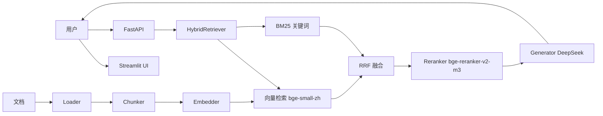

# 企业知识库 RAG 问答系统

基于 RAG 架构的企业内部知识库智能问答系统。支持多轮对话、流式输出、RAGAS 量化评估。

## 架构



## 技术栈

- **LLM**: DeepSeek (deepseek-chat)
- **Embedding**: bge-small-zh-v1.5 (ModelScope/HuggingFace)
- **Reranker**: bge-reranker-v2-m3 (ModelScope 下载)
- **向量数据库**: Chroma
- **检索**: 向量 + BM25 多路召回 + RRF 融合 + Reranker 精排
- **后端**: FastAPI + uvicorn
- **前端**: Streamlit
- **评估**: RAGAS (context_precision / recall / faithfulness)
- **文档解析**: PyMuPDF / python-docx

## 功能

- [x] 支持 PDF / DOCX / TXT / CSV 文档加载
- [x] 文档切块（递归降级 + overlap）
- [x] Embedding + 向量库存储
- [x] HybridRetriever（向量 + BM25 + RRF 融合）
- [x] Reranker 精排
- [x] LLM 生成回答 + 流式输出
- [x] 答案引用来源标注
- [x] REST API（6 端点）
- [x] 多轮对话
- [x] RAGAS 量化评估（三策略横向对比）

## API 端点

| 方法 | 路径 | 说明 |
|------|------|------|
| POST | `/upload` | 上传文档入库 |
| POST | `/search` | 检索文档块 |
| POST | `/chat` | 单轮问答（非流式） |
| POST | `/chat/stream` | 单轮问答（SSE 流式） |
| POST | `/chat/multi` | 多轮对话 |
| POST | `/chat/multi/stream` | 多轮对话（流式） |
| GET  | `/documents` | 已入库文档列表 |
| GET  | `/health` | 健康检查 |

## 评估结果（Day 39 RAGAS）

| 指标 | 纯向量 | Hybrid | Hybrid+Rerank |
|------|:--:|:--:|:--:|
| precision | 0.40 | 0.33 | **0.53** |
| recall | 0.68 | 0.58 | **0.73** |
| faithfulness | 0.61 | **0.71** | 0.63 |

> 详见 `docs/eval_report.md`

## 开发进度

| 模块 | 天数 | 状态 |
|------|------|------|
| 项目骨架 + 依赖 | Day 29 | ✅ |
| 文档加载器 (loader/) | Day 30 | ✅ |
| 文本切分 (chunker/) | Day 31 | ✅ |
| Embedding 模块 (embedder/) | Day 32 | ✅ |
| 向量存储 (retriever/) | Day 33 | ✅ |
| 检索模块 (Hybrid+Reranker) | Day 34 | ✅ |
| 生成模块 (generator/) | Day 35 | ✅ |
| FastAPI (api/) | Day 36 | ✅ |
| 端到端集成 | Day 37 | ✅ |
| Streamlit UI | Day 38 | ✅ |
| RAGAS 评估 | Day 39 | ✅ |
| Hybrid+Reranker 接入 | Day 40 | ✅ |
| 多轮对话 + README 完善 | Day 41 | ✅ |
| 里程碑检验 + 项目收尾 | Day 42 | ✅ |

## 项目结构

```
src/
├── models.py      # 核心数据结构 (Document/Chunk)
├── loader/        # 文档加载 (PDF/DOCX/TXT/CSV)
├── chunker/       # 文本切分 (递归降级+overlap)
├── embedder/      # 向量化
├── retriever/    # 检索
├── generator/     # LLM 生成
└── api/           # FastAPI 接口
```

## 快速开始

```bash
# 安装依赖
pip install -r requirements.txt  # 或 poetry install

# 下载模型（首次需要）
python -c "from modelscope import snapshot_download; snapshot_download('BAAI/bge-reranker-v2-m3', cache_dir='C:/Users/yang/.cache/modelscope')"

# 配置 API Key
cp .env.example .env  # 编辑填入 DEEPSEEK_API_KEY

# 启动 API
python -m uvicorn src.api.main:app --reload

# 启动 Streamlit UI（另一个终端）
python -m streamlit run app.py
```

## 运行测试

```bash
pytest tests/ -v                       # 单元测试
python tests/test_ragas_eval.py        # RAGAS 评估（需要先上传文档）
```